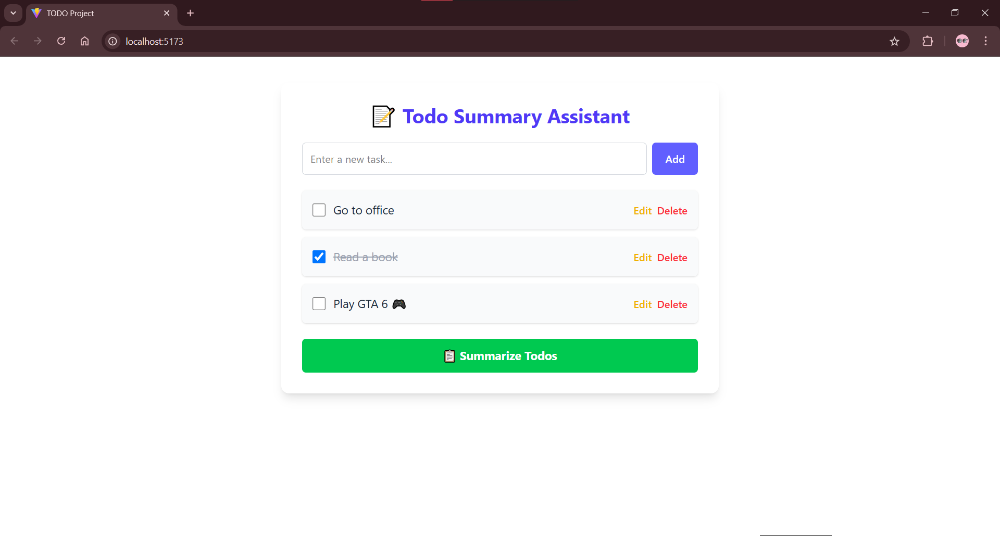

# 📝 Todo Summary Assistant

An AI-powered full-stack web app that lets users manage their personal to-dos and summarize them using the **Google Gemini** API.

---


## 🚀 Features

* ✅ Add, edit, delete personal to-do items
* 📋 Mark tasks as complete/incomplete
* 🤖 Generate intelligent summaries of pending tasks using Gemini API
* 🧠 Clean UI built with React + Tailwind CSS
* ⚙️ Java + Spring Boot backend with RESTful APIs

---

## 🧰 Tech Stack

| Layer      | Technology          |
| ---------- | ------------------- |
| Frontend   | React, Tailwind CSS |
| Backend    | Java, Spring Boot   |
| Database   | H2 (in-memory)      |
| AI Summary | Gemini API (Google) |

---


## 🧱 How I Built This Project

### 1. **Backend: Spring Boot**

* Created a REST API with the following endpoints:
  `GET /todos`, `POST /todos`, `DELETE /todos/{id}`, `POST /summarize`
* Used an in-memory **H2 database** for simplicity
* Integrated **Google Gemini API** using `RestTemplate` to fetch meaningful summaries of the current to-dos

### 2. **Frontend: React + Tailwind CSS**

* Used React hooks (`useState`, `useEffect`) to manage to-do state
* Designed a clean, responsive UI with Tailwind
* Added features to:

  * Toggle completed tasks
  * Edit tasks inline
  * Send summary request via button

### 3. **LLM Integration**

* Used **Gemini API** via REST call from Spring Boot backend
* API Key is stored in `.env` file (not hardcoded in codebase)
* The `/summarize` endpoint collects pending todos and sends them to Gemini for a human-readable summary

---

## 🛠️ Setup Instructions

### 📦 1. Clone the Repository

```bash
git clone https://github.com/Maaz1010/TODO-Summarizer
cd todo-summarizer
```

---

### 💻 2. Backend Setup (Spring Boot)

```bash
cd server
```

Make sure the following properties are configured in `application.properties`:

```properties
spring.datasource.url=jdbc:h2:mem:todos
spring.datasource.driverClassName=org.h2.Driver
spring.datasource.username=sa
spring.datasource.password=
spring.jpa.database-platform=org.hibernate.dialect.H2Dialect
spring.h2.console.enabled=true
GEMINI_API_KEY=my_gemini_api_key
```


The backend will be available at:
[http://localhost:8080](http://localhost:8080)

---

### 🌐 3. Frontend Setup (React)

```bash
cd client
npm install
cp .env.example .env
```

Set your API URL and Gemini key in `.env`:

```env
VITE_API_BASE_URL=http://localhost:8080
VITE_GEMINI_API_KEY=your_gemini_api_key_here
```

**Run the frontend:**

```bash
npm run dev
```

Frontend runs at:
[http://localhost:5173](http://localhost:5173)

---

## 🔑 Gemini API Setup

1. Go to: [Google AI Studio – API Keys](https://aistudio.google.com/app/apikey)
2. Click **"Create API Key"**
3. Copy the key and add it to both:

   * Backend (`application.properties` as `GEMINI_API_KEY`)
   * Frontend `.env` as `VITE_GEMINI_API_KEY`

---

## 📋 .env.example

```env
# Frontend: client/.env.example
VITE_API_BASE_URL=http://localhost:8080
VITE_GEMINI_API_KEY=my_gemini_api_key
```

---

## 📡 API Endpoints

| Method | Endpoint      | Description               |
| ------ | ------------- | ------------------------- |
| GET    | `/todos`      | Fetch all todos           |
| POST   | `/todos`      | Add or update a todo      |
| DELETE | `/todos/{id}` | Delete a todo by ID       |
| POST   | `/summarize`  | Generate summary (Gemini) |

---

## 🧪 Testing the App

1. Open your browser to [http://localhost:5173](http://localhost:5173)
2. Add a few to-do items
3. Toggle some as completed
4. Click **"Summarize Todos"** to view a Gemini-generated summary!

---

## 🖼️ Preview





